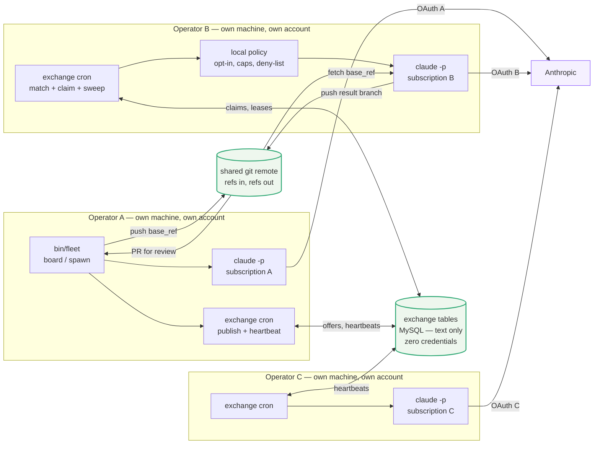
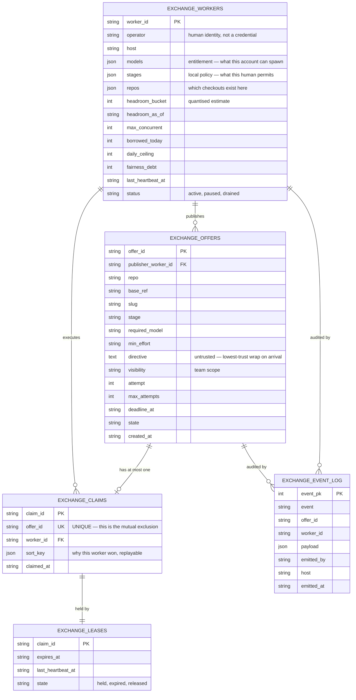
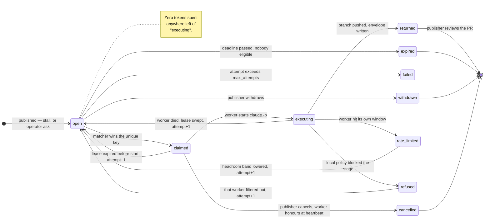
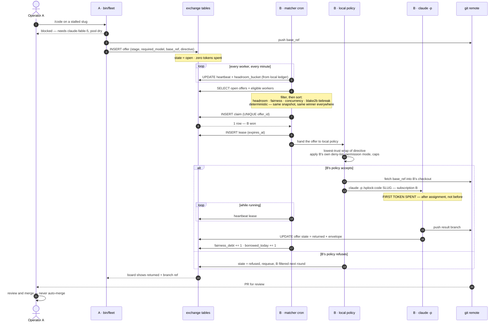
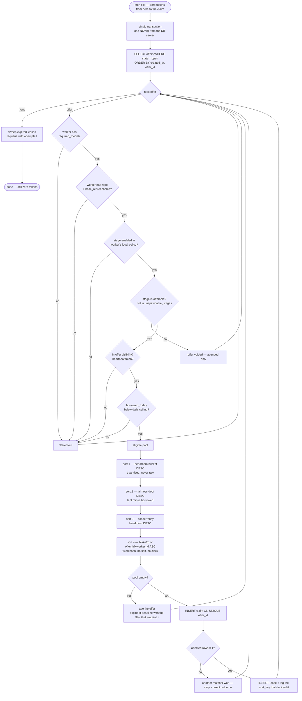
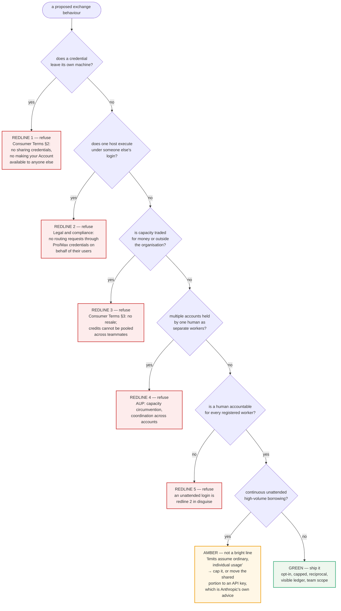
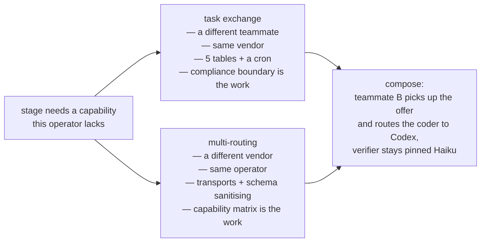

# Task exchange — diagrams

Companion to [`docs/TASK_EXCHANGE.md`](TASK_EXCHANGE.md), which carries the
prose, the invariants, and the compliance boundary. This file is the picture.
All diagrams are mermaid and render natively on GitHub.

**Status:** concept. Nothing here is implemented.

---

## 1. Topology — what runs where

The central component is a **table**, not a service. It holds text. It never
holds a credential and never makes a model call. Every model call happens inside
an operator's own boundary, on that operator's own account.

The three arrows into Anthropic never cross an operator boundary. That is the
whole compliance argument in one picture: **N humans, N accounts, N machines,
each spending only their own pool on work their own policy accepted.**

---

## 2. Data model

Five tables on the connection splock's intent registry already uses. Note what
is absent: there is no column anywhere for a token, a key, a cookie, or a
session. There is nowhere to put one.

---

## 3. Offer lifecycle

Every transition out of `open` is a database write with no model call behind it.
The first token is spent on entry to `executing`, and only there.

---

## 4. End-to-end sequence

The motivating case: operator A's `/code` stage needs Fable and A's pool is dry
or A has no Fable entitlement.

---

## 5. The matcher — deterministic by construction

Eligibility is a filter; nothing in it can be outweighed. The sort below it has
no float, no `RANDOM()`, and no wall-clock read inside a comparison, so two
matchers on two machines against one snapshot cannot disagree.

---

## 6. The compliance gate

The design's shape is not a matter of taste. Each refusal below maps to a quoted
clause in [`docs/TASK_EXCHANGE.md`](TASK_EXCHANGE.md#compliance--where-the-redline-is).

---

## 7. Where this sits beside multi-routing

Two answers to one problem — "this stage needs capability I do not have right
now." They compose: a worker that picks up an offer may itself route the stage
to another vendor.

